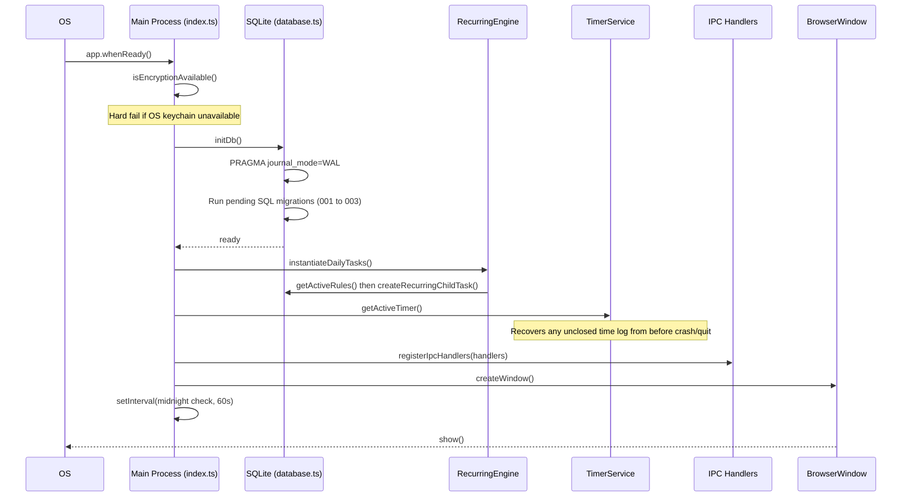
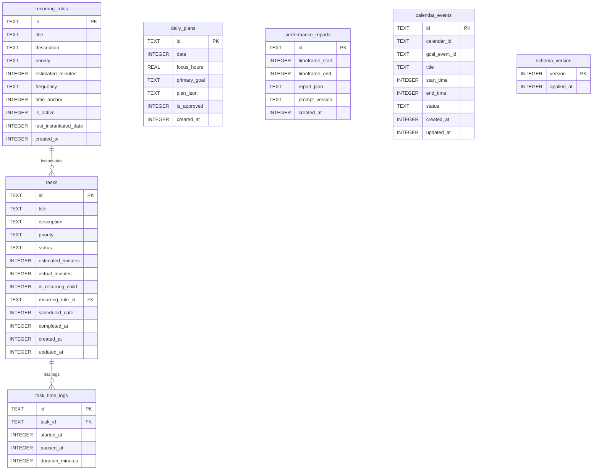
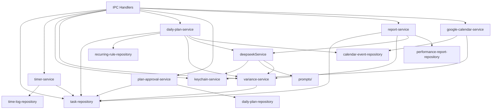
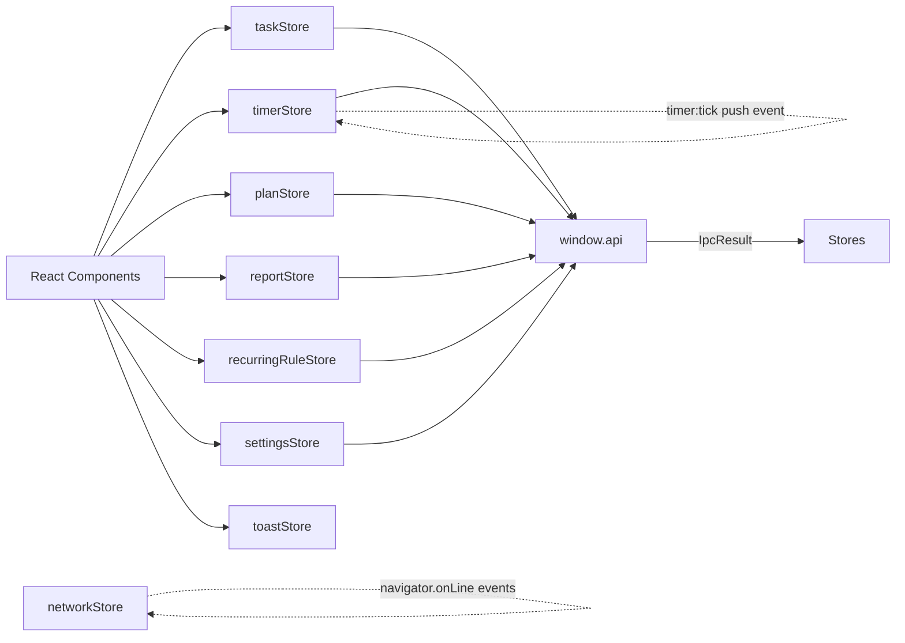
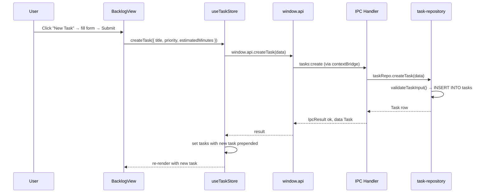
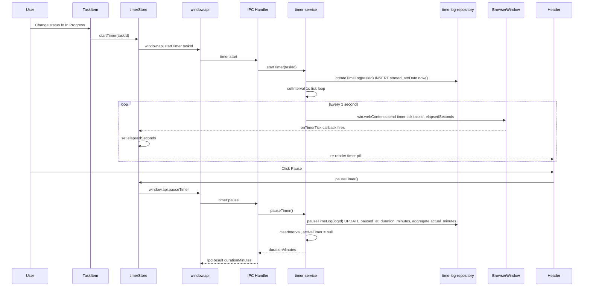
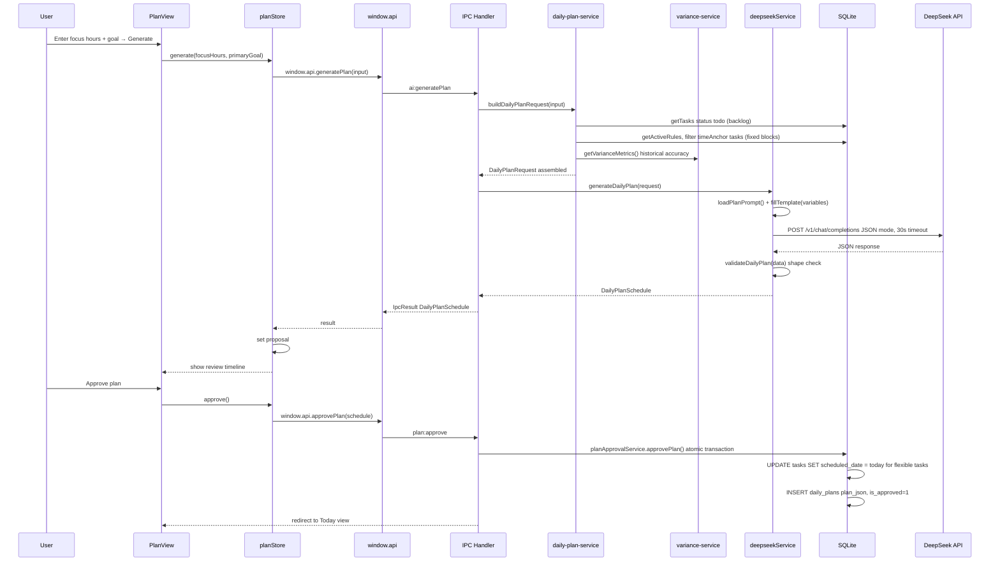
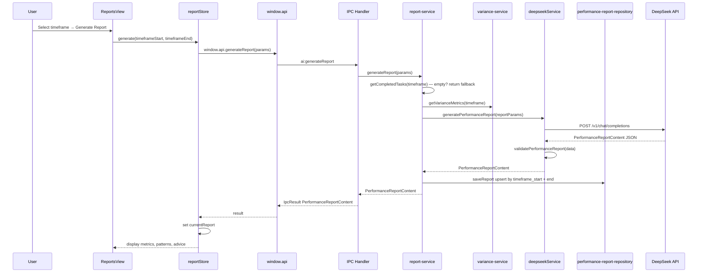
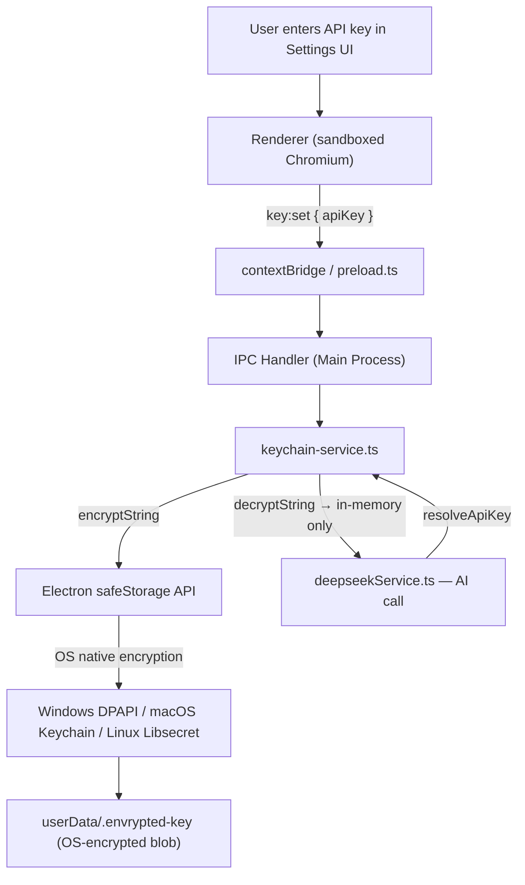

# ARCHITECTURE.md — AI Task & Performance Planner

> **Status**: Living document. Reflects the codebase as of the completed TKT-001 → TKT-025 implementation.  
> **Cross-references**: [`AGENTS.md`](./AGENTS.md) (rules), [`TECHNICAL_STACK.md`](./TECHNICAL_STACK.md) (stack choices), [`DESIGN.md`](./DESIGN.md) (UI system), [`TICKET.md`](./TICKET.md) (feature status).

---

## Table of Contents

1. [System Context](#1-system-context)
2. [Process Model & Security Boundary](#2-process-model--security-boundary)
3. [Application Startup Boot Sequence](#3-application-startup-boot-sequence)
4. [Main Process Layer](#4-main-process-layer)
   - 4.1 [Database Layer (SQLite)](#41-database-layer-sqlite)
   - 4.2 [Repository Pattern](#42-repository-pattern)
   - 4.3 [Service Layer](#43-service-layer)
   - 4.4 [IPC Handler Layer](#44-ipc-handler-layer)
5. [IPC Bridge Layer (Shared / Preload)](#5-ipc-bridge-layer-shared--preload)
   - 5.1 [Typed Channel Map](#51-typed-channel-map)
   - 5.2 [Standardised IpcResult](#52-standardised-ipcresult)
   - 5.3 [contextBridge Exposure](#53-contextbridge-exposure)
6. [Renderer Process Layer](#6-renderer-process-layer)
   - 6.1 [Application Shell & Routing](#61-application-shell--routing)
   - 6.2 [Zustand State Stores](#62-zustand-state-stores)
   - 6.3 [Component Tree](#63-component-tree)
7. [Shared Domain Models](#7-shared-domain-models)
8. [Key End-to-End Data Flows](#8-key-end-to-end-data-flows)
   - 8.1 [Task CRUD Flow](#81-task-crud-flow)
   - 8.2 [Precision Timer Flow](#82-precision-timer-flow)
   - 8.3 [Morning Standup (AI Planning) Flow](#83-morning-standup-ai-planning-flow)
   - 8.4 [Performance Report Generation Flow](#84-performance-report-generation-flow)
9. [Background Services](#9-background-services)
10. [AI Integration Engine (DeepSeek)](#10-ai-integration-engine-deepseek)
11. [Security Architecture](#11-security-architecture)
12. [Build & Toolchain](#12-build--toolchain)

---

## 1. System Context

The application is a **local-first desktop productivity tool** built on Electron. It combines structured task management with AI-assisted scheduling and performance coaching. All user data (tasks, time logs, plans) lives in a local SQLite database. Network access is required only for DeepSeek API calls.

```
┌─────────────────────────────────────────────────────────────────────────────┐
│                             User's Machine                                  │
│                                                                             │
│  ┌──────────────────────────────────────────────────────────────────────┐   │
│  │                    Electron Application Bundle                        │   │
│  │                                                                      │   │
│  │   ┌────────────────────────────┐    ┌──────────────────────────────┐ │   │
│  │   │     Main Process           │    │      Renderer Process         │ │   │
│  │   │    (Node.js / V8)          │◄──►│   (Chromium / React 18)       │ │   │
│  │   │                            │IPC │                              │ │   │
│  │   │  • SQLite (better-sqlite3) │    │  • React UI Components       │ │   │
│  │   │  • safeStorage Vault       │    │  • Zustand Stores            │ │   │
│  │   │  • DeepSeek HTTP Client    │    │  • TipTap Editor             │ │   │
│  │   │  • Background Services     │    │  • Tailwind CSS              │ │   │
│  │   └────────────────────────────┘    └──────────────────────────────┘ │   │
│  └──────────────────────────────────────────────────────────────────────┘   │
│                                             │                               │
│  userData/                                  │ HTTPS                          │
│  ├── app.db   (SQLite WAL)                  ▼                               │
│  └── .envrypted-key (DPAPI blob)    ┌───────────────┐                      │
│                                     │  DeepSeek API  │                      │
│                                     │  (external)    │                      │
│                                     └───────────────┘                      │
└─────────────────────────────────────────────────────────────────────────────┘
```

---

## 2. Process Model & Security Boundary

Electron enforces a **hard security boundary** between the two processes. The Renderer cannot directly access Node.js APIs, the file system, or the database.

| Property           | Main Process                 | Renderer Process                       |
| ------------------ | ---------------------------- | -------------------------------------- |
| Runtime            | Node.js + V8                 | Chromium (sandboxed)                   |
| `nodeIntegration`  | N/A                          | `false`                                |
| `contextIsolation` | N/A                          | `true`                                 |
| `sandbox`          | N/A                          | `true`                                 |
| DB Access          | ✅ Direct (synchronous)      | ❌ None                                |
| OS APIs            | ✅ Full                      | ❌ None                                |
| Network            | ✅ (DeepSeek via OpenAI SDK) | ❌ (navigator.onLine check only)       |
| Communication      | IPC via `ipcMain.handle`     | IPC via `window.api.*` (contextBridge) |

Window configuration (`src/main/index.ts`):

```typescript
new BrowserWindow({
  width: 1200,
  height: 800,
  minWidth: 900,
  minHeight: 600,
  webPreferences: {
    preload: join(__dirname, "../preload/index.js"),
    sandbox: true,
    contextIsolation: true,
    nodeIntegration: false,
  },
});
```

---

## 3. Application Startup Boot Sequence

The main process orchestrates a strict, ordered startup sequence before the window is shown.



**Key startup invariants:**

- If `safeStorage.isEncryptionAvailable()` returns `false`, the app throws immediately — API keys cannot be stored securely.
- Recurring tasks are instantiated atomically in a SQLite transaction (dedup guard via `last_instantiated_date`).
- Timer recovery restores the in-memory `activeTimer` state from any unclosed `task_time_logs` row, preventing lost time tracking after unexpected quit.

---

## 4. Main Process Layer

### 4.1 Database Layer (SQLite)

**File**: `src/main/db/database.ts`  
**Driver**: `better-sqlite3` (synchronous; no `async/await` required in the main process)

```
src/main/db/
├── database.ts              ← getDb() singleton + initDb() with WAL pragma
├── migration-runner.ts      ← Applies numbered SQL files sequentially
├── migrations/
│   ├── 001_init.sql         ← 6 tables: tasks, task_time_logs, recurring_rules,
│   │                            daily_plans, performance_reports, schema_version
│   ├── 002_recurring_config.sql ← days_of_week, day_of_month columns
│   ├── 003_task_completed_at.sql ← completed_at column on tasks
│   ├── 004_app_settings.sql      ← persisted non-secret app preferences
│   └── 005_calendar_events.sql   ← Google Calendar busy-event cache
└── *-repository.ts          ← One repository per aggregate (see 4.2)
```

#### Database Schema



**Storage conventions:**

- All timestamps: Unix epoch **milliseconds** (`Date.now()`).
- All durations: integer **minutes**.
- IDs: `crypto.randomUUID()`.
- SQL columns: `snake_case` → TypeScript properties: `camelCase` (via `rowToTask()` mapper in each repository).
- All writes: prepared statements only (no string interpolation).

---

### 4.2 Repository Pattern

Each database aggregate has its own typed repository module. No raw SQL is scattered outside these files.

| File                               | Aggregate           | Key Operations                                                                                                                                         |
| ---------------------------------- | ------------------- | ------------------------------------------------------------------------------------------------------------------------------------------------------ |
| `task-repository.ts`               | `Task`              | `getTasks(filters)`, `createTask`, `updateTask`, `deleteTask`, `createRecurringChildTask`, `getCompletedTasks(timeframe?)`, `validateStatusTransition` |
| `time-log-repository.ts`           | `TimeLog`           | `createTimeLog`, `pauseTimeLog` (computes duration, aggregates to `tasks.actual_minutes`), `getUnclosedTimeLog`                                        |
| `recurring-rule-repository.ts`     | `RecurringRule`     | `getAllRules`, `createRule`, `updateRule`, `deleteRule`, `toggleRule`, duplicate time-anchor validation                                                |
| `daily-plan-repository.ts`         | `DailyPlan`         | `getPlanForDate`, `saveApprovedPlan` (upsert)                                                                                                          |
| `performance-report-repository.ts` | `PerformanceReport` | `saveReport` (upsert by timeframe), `listAll`, `getById`, `findByTimeframe`, `deleteById`                                                              |
| `calendar-event-repository.ts`     | `CalendarEvent`     | range query and atomic replacement of a synced calendar window                                                                                         |

**State Transition Guard** (in `task-repository.ts`):

```
todo ──────────────► in_progress
  ▲                     │
  └─────────────────────┘  (pause/todo)

in_progress ──────────► completed
```

Any other transition throws `VALIDATION_ERROR: STATE_TRANSITION_ILLEGAL`.

---

`in_progress` additionally requires a persisted non-null `scheduled_date`.
Scheduling and starting cannot be combined to bypass this repository guard.

### 4.3 Service Layer

Services orchestrate business logic above the raw repository level. They are the **only callers of the DeepSeek API** and the only place where cross-repository transactions happen.

```
src/main/services/
├── keychain-service.ts       ← safeStorage encrypt/decrypt/delete API key
├── timer-service.ts          ← Background-safe tick loop; start/pause/recover
├── recurring-engine.ts       ← Instantiate today's tasks from active rules
├── variance-service.ts       ← Compute delta = Actual minus Estimated; format prompt context
├── daily-plan-service.ts     ← Assemble DailyPlanRequest; validate focusHours
├── plan-approval-service.ts  ← Atomic approvePlan: schedule tasks + persist plan_json
├── report-service.ts         ← Orchestrate AI report: gather tasks + variance + cache
├── deepseekService.ts        ← DeepSeek HTTP client (retry, backoff, validation)
├── google-calendar-service.ts ← OAuth PKCE, encrypted token refresh, 15-minute event sync
└── prompts/
    ├── plan-v1.txt           ← Versioned plan prompt template
    └── report-v1.txt         ← Versioned report prompt template
```

**Service dependency diagram:**



---

### 4.4 IPC Handler Layer

**Files**: `src/main/ipc/handlers.ts`, `src/main/ipc/register-ipc.ts`

The handler map is a single exported constant typed against `IpcChannelMap`. Every handler returns `IpcResult<T>` and never throws across the IPC bridge.

```typescript
// Pattern for every handler:
"tasks:create": (data) => {
  try {
    const task = taskRepo.createTask(data);
    return ok(task);      // { ok: true, data: Task }
  } catch (err) {
    return fail("DB_WRITE_FAILED", "Failed to create task.");
  }
}
```

**Special orchestration in `tasks:update`**: When status transitions to `in_progress`, the handler automatically calls `timerService.startTimer()`. When transitioning to `completed`, it closes any unclosed time log first to ensure `actual_minutes` is complete before variance is computed.

---

Timer-affecting `tasks:update` mutations are delegated to
`timerService.updateTaskWithTimerEffects()`. Start, handoff, completion, and
active-task return-to-Backlog writes run transactionally before in-memory timer
state or renderer tick state changes.

## 5. IPC Bridge Layer (Shared / Preload)

This layer is the **strict contract** between Main and Renderer. Nothing leaks across without being declared here.

```
src/shared/
├── models.ts       ← All domain interfaces (Task, RecurringRule, DailyPlan, etc.)
├── ipcChannels.ts  ← IpcChannelMap: typed request/response per channel
├── ipcResult.ts    ← IpcResult<T>, IpcError, IpcErrorCode, ok(), fail()
├── api.ts          ← Renderer-side wrapper functions over window.api
└── global.d.ts     ← window.api type declaration

src/preload/index.ts  ← contextBridge.exposeInMainWorld('api', { ... })
```

### 5.1 Typed Channel Map

Every IPC channel is declared with its exact request and response types. The full channel list covers the application namespaces below:

| Namespace     | Channels                                                                      | Purpose                               |
| ------------- | ----------------------------------------------------------------------------- | ------------------------------------- |
| `tasks:*`     | getAll, create, update, delete                                                | Task CRUD + status transitions        |
| `timer:*`     | start, pause, getActive                                                       | Background-safe time tracking         |
| `ai:*`        | generatePlan, generateReport, testConnection                                  | DeepSeek API features                 |
| `report:*`    | list, get, delete                                                             | Cached report history                 |
| `key:*`       | set, get, delete                                                              | API key management                    |
| `recurring:*` | getAll, create, update, delete, toggle                                        | Recurring rule CRUD                   |
| `metrics:*`   | getVariance, getTaskVariance                                                  | Estimation analytics                  |
| `plan:*`      | getToday, approve                                                             | Plan persistence                      |
| `calendar:*`  | getSettings, updateSettings, connect, sync, getTodayEvents, getTodayConflicts | Read-only Google Calendar integration |

### 5.2 Standardised IpcResult

All responses are wrapped in a discriminated union. This eliminates try/catch in the Renderer:

```typescript
export type IpcResult<T> =
  { ok: true; data: T } | { ok: false; error: IpcError };

// Usage in renderer:
const result = await window.api.createTask(data);
if (result.ok) {
  // result.data: Task
} else {
  // result.error: { code: IpcErrorCode, message: string }
}
```

**Full error code set (`IpcErrorCode`):**

| Category   | Codes                                                                                                        |
| ---------- | ------------------------------------------------------------------------------------------------------------ |
| Database   | `DB_READ_FAILED`, `DB_WRITE_FAILED`                                                                          |
| Validation | `VALIDATION_ERROR`, `STATE_TRANSITION_ILLEGAL`, `NOT_FOUND`                                                  |
| AI         | `AI_TIMEOUT`, `AI_RATE_LIMITED`, `AI_AUTH_FAILED`, `AI_PARSE_ERROR`, `AI_NETWORK_ERROR`, `AI_REQUEST_FAILED` |
| Keychain   | `KEYCHAIN_UNAVAILABLE`, `KEYCHAIN_WRITE_FAILED`                                                              |
| Timer      | `TASK_ALREADY_ACTIVE`, `TIMER_START_FAILED`, `TIMER_PAUSE_FAILED`, `TIMER_READ_FAILED`                       |
| Report     | `REPORT_CORRUPTED`                                                                                           |
| General    | `NOT_IMPLEMENTED`, `INTERNAL_ERROR`                                                                          |

### 5.3 contextBridge Exposure

The preload script exposes a safe, named API surface to `window.api`. The Renderer has **no access to `ipcRenderer` directly** — only the functions deliberately whitelisted here.

One special channel bypasses the request/response model: `timer:tick` is a **push channel** (Main → Renderer). The preload exposes `onTimerTick(callback)` which internally calls `ipcRenderer.on('timer:tick', callback)`. This enables the live timer display in the Header without polling.

---

## 6. Renderer Process Layer

### 6.1 Application Shell & Routing

The Renderer uses **in-memory state routing** (no React Router). The `AppShell` component holds the active view name in `useState` and conditionally renders the application views.

```
App.tsx
└── AppShell.tsx                  ← Layout shell + view router
    ├── Header.tsx                ← App name, active timer pill (live), theme toggle
    ├── Sidebar.tsx               ← Nav links (Ctrl+1–4 keyboard shortcuts)
    ├── <main>
    │   ├── BacklogView.tsx       ← view="backlog"
    │   ├── TodayView.tsx         ← view="today"
    │   ├── PlanView.tsx          ← view="plan"
    │   ├── ReportsView.tsx       ← view="reports"
    │   └── SettingsView.tsx      ← view="settings"
    ├── StatusFooter.tsx          ← DB sync status, API key status, clock, offline indicator
    └── ToastContainer.tsx        ← Global toast notification overlay
```

**Keyboard navigation**: `Ctrl+1` → Backlog, `Ctrl+2` → Today, `Ctrl+3` → Daily Plan, `Ctrl+4` → Reports.

**Initialization on mount** (`useEffect`):

1. `useTimerStore.getState().initTimer()` — fetches active timer state from Main via `timer:getActive`, subscribes to `timer:tick` push events.
2. `useNetworkStore.getState().initNetwork()` — attaches `online`/`offline` listeners with 1-second debounce.

Pomodoro initialization also calls `usePomodoroStore.getState().initPomodoro()` to restore renderer-local state, including configured durations, and reconcile any deadline-based countdown.

### 6.2 Zustand State Stores

All stores are in `src/renderer/src/stores/`. They are the **single source of truth** for UI state. Components never call `window.api` directly.

| Store                | State                                                   | Key Actions                                                          |
| -------------------- | ------------------------------------------------------- | -------------------------------------------------------------------- |
| `taskStore`          | `tasks[]`, `isLoading`, `error`                         | `fetchTasks`, `createTask`, `updateTask`, `deleteTask`               |
| `timerStore`         | `activeTaskId`, `elapsedSeconds`                        | `initTimer`, `startTimer`, `pauseTimer`                              |
| `planStore`          | `proposal`, `status`                                    | `generate`, `updateBudget`, `reorder`, `remove`, `approve`           |
| `recurringRuleStore` | `rules[]`                                               | `fetchRules`, `createRule`, `updateRule`, `deleteRule`, `toggleRule` |
| `reportStore`        | `reports[]`, `currentReport`                            | `generate`, `loadReports`, `viewReport`, `deleteReport`              |
| `settingsStore`      | `hasKey`                                                | `saveKey`, `deleteKey`, `testConnection`                             |
| `networkStore`       | `isOnline`                                              | `initNetwork`                                                        |
| `themeStore`         | `theme` ("dark"\|"light")                               | `toggleTheme`, `initTheme`                                           |
| `pomodoroStore`      | mode, countdown, interval total, configurable durations | `start`, `pause`, `reset`, `skip`, `selectMode`, `saveDurations`     |
| `toastStore`         | `toasts[]`                                              | `addToast`, `removeToast`                                            |

**Store interaction model:**



### 6.3 Component Tree

```
AppShell
├── Header
│   ├── App Logo + Title
│   ├── ActiveTimerPill          ← pulse indicator + HH:MM:SS + Pause button
│   └── ThemeToggleButton        ← Sun/Moon icon (Tooltip wrapped)
│
├── Sidebar
│   └── NavItem[] (Lucide icons) ← Backlog, Today, Daily Plan, Reports, Settings
│
├── BacklogView
│   ├── SearchBar + SortControls
│   ├── TaskItem[]
│   │   ├── PriorityBadge
│   │   ├── StatusBadge
│   │   ├── VarianceBadge        ← delta badge on completed tasks
│   │   └── Tooltip (icon buttons)
│   └── TaskForm (modal)
│       └── MarkdownEditor (TipTap)
│
├── TodayView
│   ├── AnchoredTasksGroup       ← fixed blocks with lock icon + time label
│   ├── FlexibleTasksGroup       ← free tasks for today
│   └── CompletedGroup           ← collapsible section
│
├── PlanView
│   ├── GenerateForm             ← focusHours + primaryGoal inputs
│   ├── PlanBlockRow[]           ← inline budget edit + reorder + remove
│   └── ApprovePlanDialog        ← focus-trapped confirmation
│
├── ReportsView
│   ├── TimeframeSelector        ← 7/14/30-day presets + custom date range
│   ├── EfficiencyGauge          ← radial score visualization
│   ├── MetricCards[]
│   ├── PriorityVarianceBars
│   ├── PatternsSection          ← AI-detected patterns
│   ├── AdviceSection            ← AI recommendations
│   └── ReportHistory            ← cached report list with view/delete
│
├── SettingsView
│   ├── ApiKeySettings           ← masked input + Save/Test/Delete
│   └── RecurringRulesPanel
│       └── RecurringRuleCard[]
│           └── RecurringRuleForm (modal)
│
├── StatusFooter
│   ├── OfflineIndicator         ← shown when navigator.onLine = false
│   ├── ApiKeyStatusDot
│   └── LiveClock
│
└── ToastContainer               ← Portal-rendered toast stack
```

---

## 7. Shared Domain Models

`src/shared/models.ts` defines all domain types used by both processes. Key types:

| Type                       | Purpose                                                                       |
| -------------------------- | ----------------------------------------------------------------------------- |
| `Task`                     | Core task entity with status, priority, time estimates, scheduling            |
| `TimeLog`                  | Start/pause interval for a single work session                                |
| `RecurringRule`            | Template for auto-generated daily tasks                                       |
| `DailyPlan`                | AI-proposed + user-approved daily schedule (DB row)                           |
| `DailyPlanSchedule`        | The structured output of `ai:generatePlan`                                    |
| `PlannedTaskBlock`         | A single scheduled item in a daily plan                                       |
| `PerformanceReport`        | Cached AI report with JSON blob                                               |
| `PerformanceReportContent` | Parsed content: metrics, patterns, advice, summary                            |
| `VarianceMetrics`          | Aggregate estimation accuracy statistics                                      |
| `TaskVariance`             | Per-task delta = actual minus estimated                                       |
| `AIScheduleInput`          | What the Renderer sends to trigger AI planning                                |
| `ReportMetrics`            | Efficiency score, trend direction, priority breakdown                         |
| `ReportPattern`            | AI-detected pattern with severity (info/warning/positive)                     |
| `ReportAdvice`             | Actionable recommendation per category (estimation/priority/scheduling/focus) |

---

## 8. Key End-to-End Data Flows

### 8.1 Task CRUD Flow



### 8.2 Precision Timer Flow

The timer is **background-safe** — it uses absolute timestamps, not accumulating counters. Minimizing the window does not cause drift.



### 8.3 Morning Standup (AI Planning) Flow



### 8.4 Performance Report Generation Flow



---

## 9. Background Services

These services run in the Main process without user interaction.

### Recurring Task Engine (`recurring-engine.ts`)

Triggered on:

1. **App startup** — `instantiateDailyTasks()` called in `app.whenReady()`.
2. **Every 60 seconds** — midnight date-rollover check: if `new Date().toDateString()` changed, re-run instantiation.

Logic per active rule:

- Skip if `last_instantiated_date >= startOfToday` (dedup guard).
- Check `matchesTodayFrequency(rule, today)` for daily / weekly / monthly match.
- If matched: `createRecurringChildTask()` sets `scheduled_date = startOfToday`, `is_recurring_child = 1`.
- All instantiations run in a **single SQLite transaction**.

### Timer Service (`timer-service.ts`)

Module-level singletons (in-memory):

```typescript
let activeTimer: ActiveTimerState | null = null; // { taskId, logId, startedAt }
let tickInterval: NodeJS.Timeout | null = null;
```

Key invariants:

- **Today-only starts.** Both `tasks:update` and `timer:start` reject a task whose
  persisted `scheduled_date` is null before touching the current timer.
- **Only one active timer at a time.** `startTimer()` pauses any other in-progress task's unclosed log before starting.
- **Atomic timer mutations.** Logs, accumulated minutes, task statuses, and
  scheduling changes commit together; renderer broadcasts happen afterward.
- **Drift-free elapsed time**: `elapsedSeconds = floor((Date.now() - startedAt) / 1000)` — always computed from the absolute start timestamp, never accumulated.
- **App quit safety**: `stopTimerEngine()` is called in the `before-quit` event, closing any open log.
- **Crash recovery**: On startup, `getActiveTimer()` scans for unclosed `task_time_logs` and reconstructs `activeTimer` in memory.

---

## 10. AI Integration Engine (Multi-Provider LLM)

**Files**:

- Orchestrator: `src/main/services/ai/ai-service.ts` (re-exported via `src/main/services/deepseekService.ts`)
- Adapters: `src/main/services/ai/adapters/` (`OpenAiCompatibleAdapter`, `AnthropicAdapter`, `GeminiAdapter`)
- Parsing & Errors: `src/main/services/ai/json-extractor.ts`, `src/main/services/ai/ai-errors.ts`
- Settings Store: `src/main/db/settings-repository.ts` (`app_settings` table)
- Secure Multi-Key Vault: `src/main/services/keychain-service.ts` (`safeStorage` encryption)

### Supported Providers & Defaults

| Provider ID | Provider Name           | Default Base URL                                   | Default Model              | Curated Presets                                                                   | Client Adapter            |
| ----------- | ----------------------- | -------------------------------------------------- | -------------------------- | --------------------------------------------------------------------------------- | ------------------------- |
| `deepseek`  | DeepSeek                | `https://api.deepseek.com/v1`                      | `deepseek-chat`            | `deepseek-chat`, `deepseek-reasoner`                                              | `OpenAiCompatibleAdapter` |
| `openai`    | OpenAI                  | `https://api.openai.com/v1`                        | `gpt-4o`                   | `gpt-4o`, `gpt-4o-mini`, `gpt-4.5-preview`, `o3-mini`                             | `OpenAiCompatibleAdapter` |
| `anthropic` | Anthropic (Claude)      | `https://api.anthropic.com/v1`                     | `claude-3-7-sonnet-latest` | `claude-3-7-sonnet-latest`, `claude-3-5-sonnet-latest`, `claude-3-5-haiku-latest` | `AnthropicAdapter` (REST) |
| `gemini`    | Google Gemini           | `https://generativelanguage.googleapis.com/v1beta` | `gemini-2.0-flash`         | `gemini-2.0-flash`, `gemini-2.0-flash-lite`, `gemini-1.5-pro`                     | `GeminiAdapter` (REST)    |
| `custom`    | Custom / Local (Ollama) | `http://localhost:11434/v1`                        | `llama3.2`                 | `llama3.2`, `mistral`, `qwen2.5`, `deepseek-r1`                                   | `OpenAiCompatibleAdapter` |

### Engine Characteristics

```
Timeout:     30,000 ms
Max Retries: 3 (manual with exponential backoff)
Backoff:     [1000ms, 2000ms, 4000ms] + Retry-After header support
JSON Parse:  Adaptive markdown fence stripper & outermost object extractor
Audit Trail: Generated daily plans and reports tag `provider` and `model` metadata
```

### Error Classification

| HTTP Status          | Error Code          | Retryable                  |
| -------------------- | ------------------- | -------------------------- |
| 401                  | `AI_AUTH_FAILED`    | No                         |
| 429                  | `AI_RATE_LIMITED`   | Yes (+ Retry-After header) |
| 4xx other            | `AI_REQUEST_FAILED` | No                         |
| 5xx                  | `AI_REQUEST_FAILED` | Yes                        |
| Timeout / AbortError | `AI_TIMEOUT`        | Yes                        |
| Network error        | `AI_NETWORK_ERROR`  | Yes                        |

### Prompt System

Prompts are **versioned text files** in `src/main/services/prompts/`:

- `plan-v1.txt` — System prompt for daily planning with placeholders:  
  `{{todayDate}}`, `{{focusHours}}`, `{{primaryGoal}}`, `{{fixedBlocksJson}}`, `{{tasksJson}}`, `{{historicalVarianceContext}}`

- `report-v1.txt` — System prompt for performance review with:  
  `{{timeframeStart}}`, `{{timeframeEnd}}`, `{{completedTasksJson}}`, `{{metricsJson}}`

The `formatVarianceContext(metrics)` function in `variance-service.ts` produces a human-readable snippet injected into the plan prompt:

```
Historical estimation accuracy:
- Overall bias: +12 min (tendency to underestimate)
- High-priority tasks: 1.4x actual/estimated ratio
- 43% of estimates within 5 min accuracy
```

### Response Validation

Both `validateDailyPlan()` and `validatePerformanceReport()` perform **structural shape validation** before any AI JSON is trusted. On failure: `AI_PARSE_ERROR` is returned — the app never crashes on a bad AI response.

---

## 11. Security Architecture



**Key security properties:**

- API key is **never** logged, sent to the Renderer, or stored in `localStorage`.
- The Renderer only ever sees `{ hasKey: boolean }` — never the actual key value.
- If `safeStorage.isEncryptionAvailable()` returns `false` at startup, the app **hard-fails** with a clear error rather than silently degrading to plaintext.
- The encrypted file is an OS-protected blob, unreadable outside the current user's OS session.
- External URLs opened from the app use `shell.openExternal()` and are blocked from opening new `BrowserWindow` instances (`setWindowOpenHandler → action: "deny"`).

---

## 12. Build & Toolchain

```
Build Target:      Electron 33+ (bundled Chromium + Node.js)
Language:          TypeScript 5.x, strict: true, noUncheckedIndexedAccess: true
Bundler:           electron-vite / Vite (HMR in dev, optimised bundles in prod)
CSS:               Tailwind CSS 3 + PostCSS
Testing:           Vitest (in-memory SQLite :memory: for main process tests)
Packaging:         electron-builder → .exe/.msi (Win), .dmg (Mac), .AppImage/.deb (Linux)
Path Aliases:      @/ → src/ (both main and renderer tsconfig)
```

**Build outputs:**

```
out/
├── main/index.js       ← Compiled Main process
├── preload/index.js    ← Compiled preload (contextBridge)
└── renderer/           ← Compiled React app (Vite bundle)

dist/                   ← electron-builder distributable installers
```

**Key npm scripts:**

| Command                 | Purpose                                       |
| ----------------------- | --------------------------------------------- |
| `npm run start`         | Dev mode with HMR (Vite + Electron)           |
| `npm run typecheck`     | TypeScript type-check both main + renderer    |
| `npm run lint`          | ESLint report                                 |
| `npm run lint:fix`      | ESLint auto-fix                               |
| `npm run format`        | Prettier write                                |
| `npm test`              | Vitest all tests                              |
| `npm run test:coverage` | Vitest with coverage                          |
| `npm run build`         | Production compile                            |
| `npm run package`       | Full distributable (build + electron-builder) |

> [!NOTE]
> After running `npm run package`, run `npm rebuild better-sqlite3` to restore the system-Node build for `npm test`.

---

_Last updated: 2026-09-02 — reflects TKT-001 through TKT-027, including Google Calendar integration._
